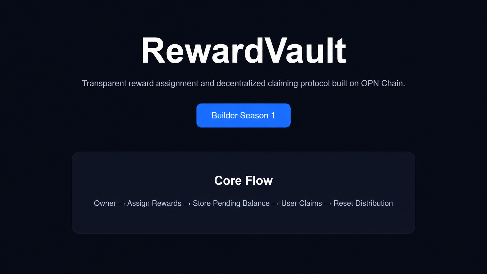

# RewardVault

  

Live Demo: https://opn-rewardvault.vercel.app

A decentralized reward distribution vault protocol built on OPN Chain for Builders Season 1.

---

## Overview

RewardVault is an experimental smart contract that demonstrates transparent reward assignment and user-controlled reward claiming.

This project explores a minimal reward distribution architecture designed for simplicity, transparency, and on-chain verification.

---

## Features

* Owner-managed reward assignment
* User self-claim mechanism
* Public reward visibility
* Lightweight architecture
* On-chain accounting

---

## Smart Contract

Contract:

contracts/RewardVault.sol

Core functions:

* assignReward(address)
* claim()
* rewardOf(address)

---

## Architecture

Owner
↓
Assign Reward
↓
Store Pending Reward
↓
User Claims Reward
↓
Reset Reward Balance

---

## Deployment

Network:
OPN Testnet (984)

Tech Stack:

* Solidity ^0.8.20
* Remix IDE
* GitHub
* Vercel

---

## Motivation

Most reward systems introduce unnecessary complexity.

RewardVault focuses on transparent distribution and simple claim execution while keeping the protocol verifiable and lightweight.

---

## Status

Season 1 Builder Submission

Experimental Prototype

MIT License
